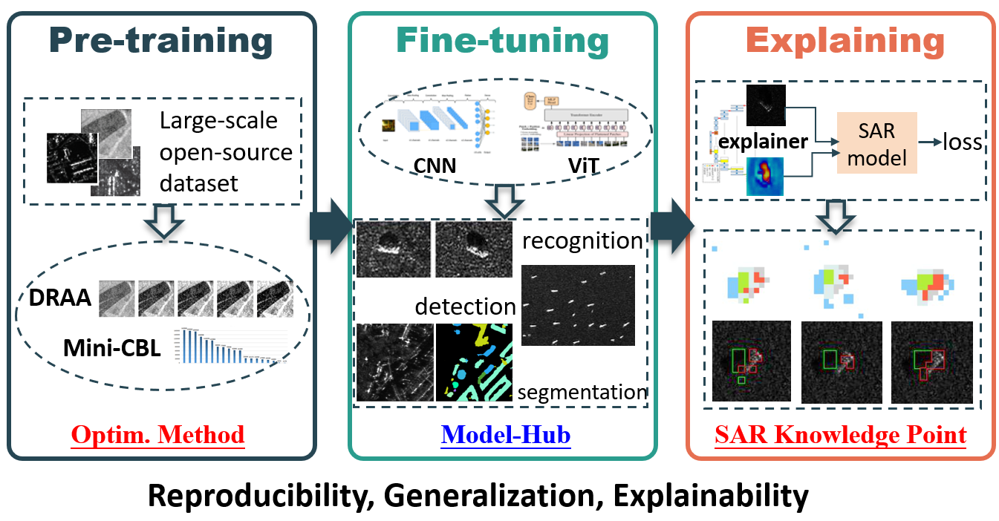

# SAR-HUB

## Introduction

This project is for paper "SAR-HUB: Pre-training, Fine-tuning, and Explaining".

### Features

1.  **Pre-training:** Deep neural networks are trained with large-scale, open-source SAR scene image datasets.
    
2.  **Fine-tuning:** The pre-trained DNNs are transferred to diverse SAR downstream tasks.
    
3.  **Explaining:** Benefits of SAR pre-trained models in comparison to optical pre-trained models are explained.
    



We release this repository with reproducibility (open-source code and datasets), generalization (sufficient experiments on different tasks), and explainability (qualitative and quantitative explanations).

### Contributions

-   An optimization method for large-scale SAR image classification is proposed to improve model performance.
    
-   A novel explanation method is proposed to explain the benefits of SAR pre-trained models qualitatively and quantitatively.
    
-   The Model-Hub offers a variety of SAR pre-trained models validated on various SAR benchmark datasets.
    

## Previously on SAR-HUB

In our previous work, we discussed what, where, and how to transfer effectively in SAR image classification and proposed the SAR image pre-trained model (ResNet-18) based on large-scale SAR scene classification that achieved good performance in SAR target recognition downstream task. We tentatively analyzed the generality and specificity of features in different layers to demonstrate the advantage of SAR pre-trained models.

```LaTeX
@article{huang2019,
  title={What, where, and how to transfer in SAR target recognition based on deep CNNs},
  author={Huang, Zhongling and Pan, Zongxu and Lei, Bin},
  journal={IEEE Transactions on Geoscience and Remote Sensing},
  volume={58},
  number={4},
  pages={2324--2336},
  year={2019},
  publisher={IEEE}
}
```

```LaTeX
@article{huang2020,
  title={Classification of large-scale high-resolution SAR images with deep transfer learning},
  author={Huang, Zhongling and Dumitru, Corneliu Octavian and Pan, Zongxu and Lei, Bin and Datcu, Mihai},
  journal={IEEE Geoscience and Remote Sensing Letters},
  volume={18},
  number={1},
  pages={107--111},
  year={2020},
  publisher={IEEE}
}
```

Based on the preliminary findings in our previous work, we released this **SAR-HUB** project as a continuous study with the following extensions:

-   To further improve the large-scale SAR scene classification performance and the feature generalization ability, we propose an optimization method with **dynamic range adapted augmentation (DRAA)** and **mini-batch class imbalanced** **loss function** **(mini-CBL)**.
    
-   In pre-training, **7** popular CNN and Transformer based architectures and **3** different large-scale SAR scene image datasets are explored, collected in Model-Hub. In fine-tuning, **7** different SAR downstream tasks are evaluated.
    
-   We propose **SAR** **knowledge point (SAR-KP)** concept, together with CAM based methods, to explain why the SAR pre-trained models outperform ImageNet and optical remote sensing image pre-trained models in transfer learning.
    

## Getting Started

### Requirements

Please refer to [requirements](requirements) for installation.

If you need to conduct experiments of SAR scene classification, target recognition or SAR knowledge point, please download the required dependencies according to [here](XAI4SAR/SAR-HUB/requirements/scene_classification.txt).

If you need to conduct experiments of SAR object detection or sementic segmentation, please refer to [object_detection.txt](requirements/object_detection.txt) and [sementic_segmentation.txt](requirements/sementic_segmentation.txt) respectively. 

### Data Prepare

#### **Scene Classification**
Please download BigEarthNet-S1.0 datasets and OpenSARUrban datasets first from:

BigEarthNet-S1.0: https://bigearth.net/

OpenSARUrban: https://pan.baidu.com/s/1D2TzmUWePYHWtNhuHL7KdQ

After that, please normalize the datasets to 0-1 and store it in *npy* format. The file directory tree is as below:

```
├── datasets
│   ├── BigEarthNet
│   │   ├── BEN-S1-npy
│   ├── OpenSARUrban
│   │   ├── OSU-npy
```

Of course, if you want to store data in your own style, then please change the *137th* and *93rd* lines of [datasets.py](SAR_scene_classification/src/dataset.py) according to the data path you store.

#### **Target Recognition**


## Contributors
